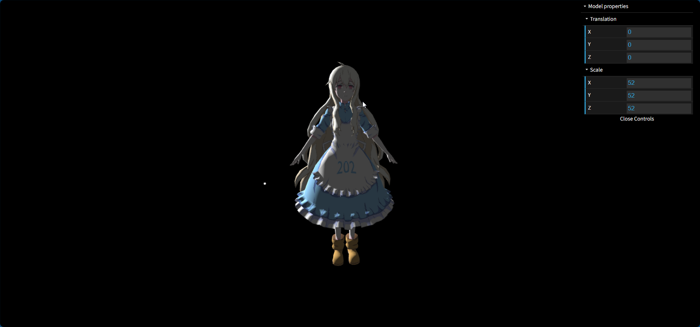
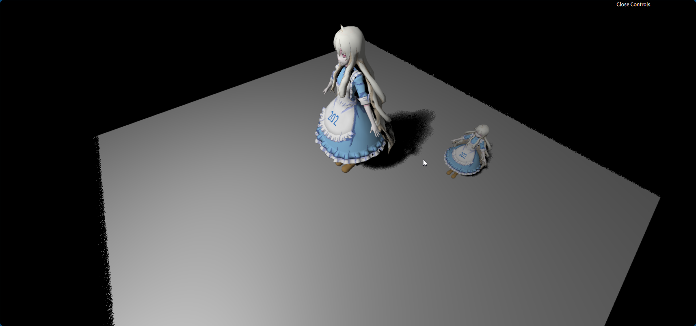
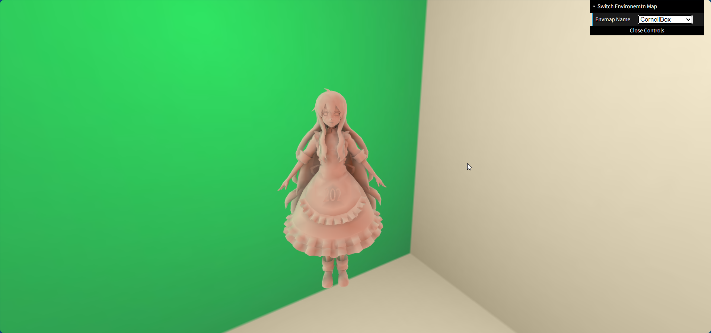
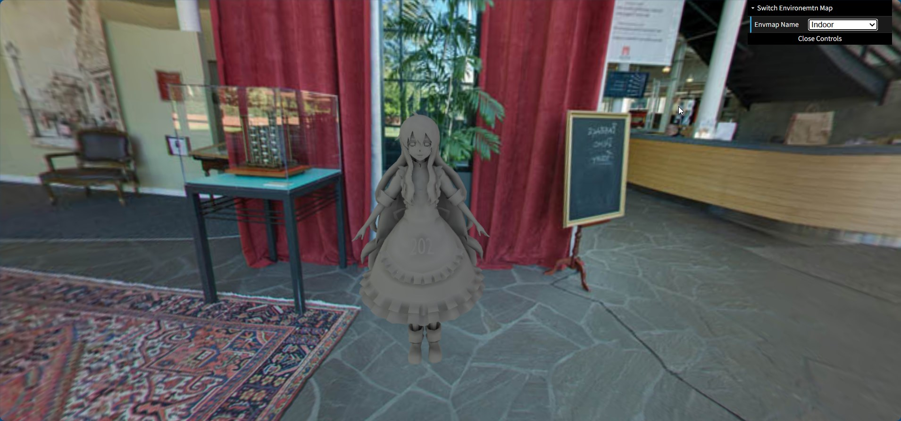
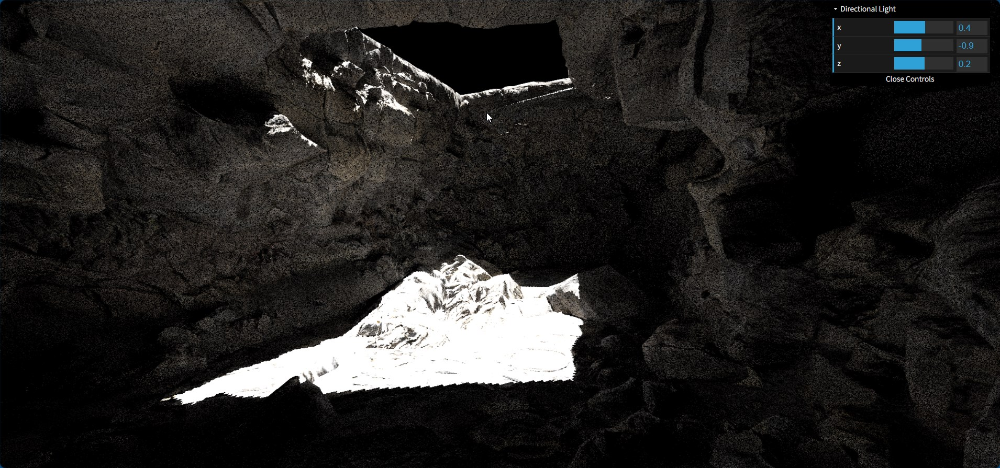
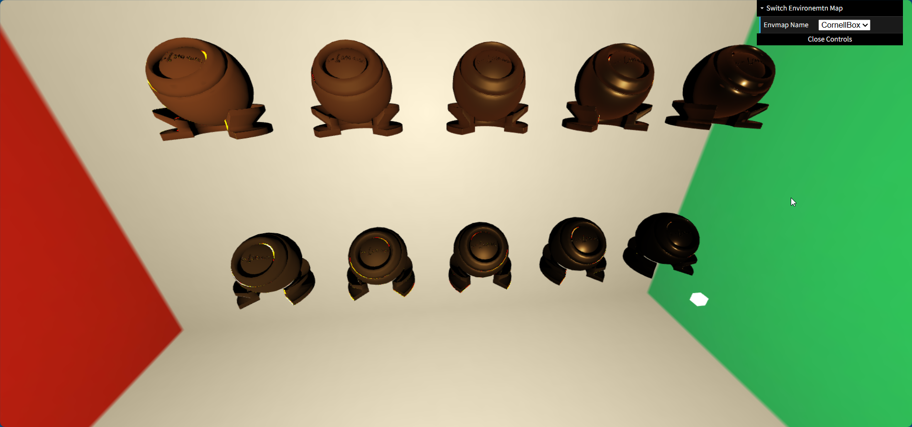

[toc]
# 0. 序言

​	这是GAMES202课程的作业备份, 主题是高质量实时渲染.

# 1. 环境搭建

​	202使用的WebGL. 只需要有一个可以启动的本地服务器即可.

​	如果你已经安装了nodejs, 那么最快的方法肯定是在vscode里安装live Server扩展.

# 2. 结果

## 2.0 环境准备

​	你需要编写顶点着色器和片段着色器的glsl. 再使用Bling Phone模型渲染.

## 2.1 PCF软阴影

​	普通的硬阴影, 可以通过**以光为相机视点计算一个额外的z-buffer(记录光能到达的最近点), 后续渲染像素时, 将该像素也投影到光为视点的坐标系中, 得到一个z深度值, 和额外的z-buffer比较, 如果差值大于某个阈值, 则视为被遮挡**.

​	软阴影的原理参考文档吧

## 2.2 球谐函数(基函数)

## 2.3 全局光照和间接光照

​	直接光+间接光

## 2.4 微表面下的能量损失修复

## 2.5 降噪

​	这次作业需要在课程主页下载资源, 有1.3个G, 就先不演示了.

# 3. 小结

​	202的课程要比101难不少. 一段时间后基本都忘了, 有空再复习吧.

