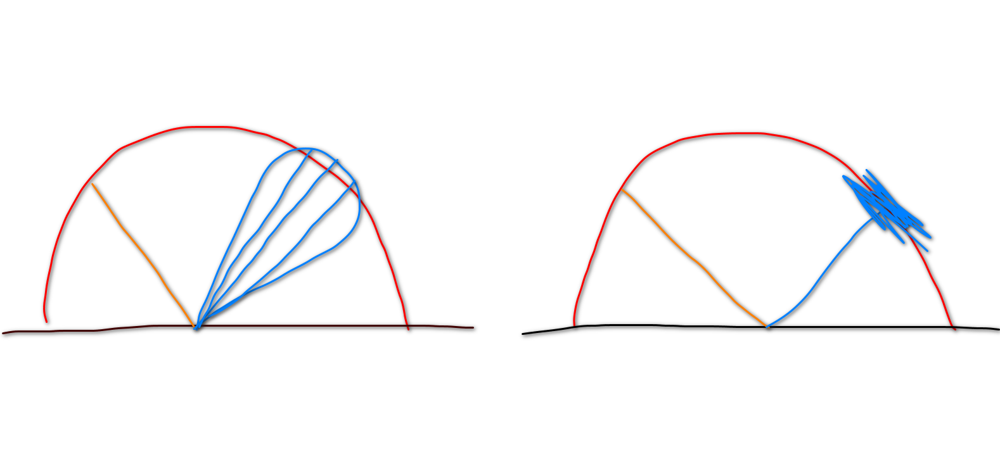
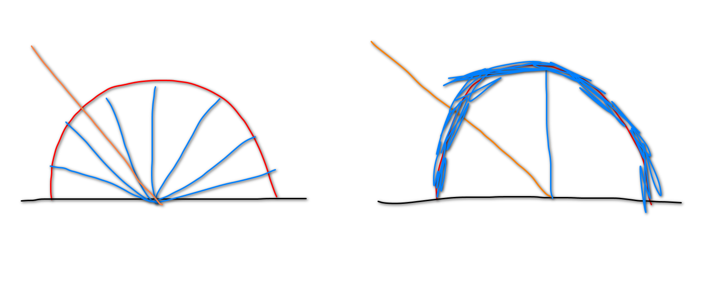
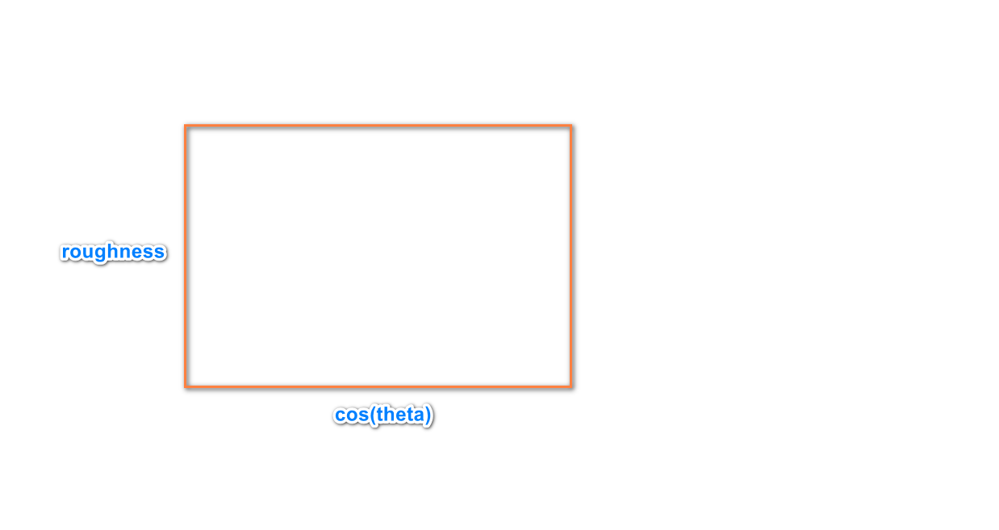

[toc]

# 0.序言

​	环境光照是一种来自**无限远**的**四面八方**的光，它与点光源，面光源的区别是它在三维空间中没有实体。环境光照的通常表示方式是使用cube_map或者sphere_map贴图。我理解的环境光照与全局光照最直接区别是**距离不同**。

# 1.IBL(Image-Base-Light)

​	基于图片的环境光，对于每一个shading point，都会接受到来自四面八方的环境光。这里**不考虑**Visibility项

​	此时的渲染方程

$$
L(p,\omega_o) = \int_{\Omega^+}{L(p, \omega_i)f_r(\omega_i, \omega_o, p)\cos{\theta_i}d\omega}
$$

## 1.1 为了能够对渲染方程快速求解，实时渲染中运用了大量的近似，来简化求解过程。这里将使用下面的近似公式：

$$
\int_{\Omega}{f(x)g(x)d\omega} \approx \frac{\int_{\Omega}{f(x)d\omega}}{\int_{\Omega}{d\omega}} * \int_\Omega{g(x)d\omega}
$$

​	可以这样验证：

f(x)在[a，b]的积分使用**黎曼积分**近似，间隔取1。则积分值约为f(a) + f(a+1) + f(a+2) + ... + f(b)。同理

g(x)在[a,，b]的积分为g(a) + g(a+1) + g(a + 2) + ... + g(b)。

f(x) * g(x) 的积分为f(a) * g(a) + f(a + 1) * g(a + 1) + f(a + 2) * g(a + 2) + ... + f(b) * g(b)。

f(x)的积分除以积分区间，再乘以g(x)的积分为

(f(a) + f(a + 1) + f(a + 2) + ... + f(b)) / [b-a] * g(a) + 

(f(a) + f(a + 1) + f(a + 2) + ... + f(b)) / [b-a] * g(a + 1) + 

(f(a) + f(a + 1) + f(a + 2) + ... + f(b)) / [b-a] * g(a + 2) +

... +

(f(a) + f(a + 1) + f(a + 2) + ... + f(b)) / [b-a] * g(b)

可以简单的看出，要使得约等式成立，(f(a) + f(a + 1) + f(a + 2) + ... + f(b)) / [b-a]的值要同时接近于f(a)，f(a + 1)，f(a + 2)，...，f(b)。即f(x)变化不能太大。

当f(x)的积分区间足够小时(假设在a的领域附近)，那么两边的值都约等于f(a)g(a)

## 1.2 render equation的近似

假设材质是diffuse的，那么它的BRDF是一个常数，假如是glossy的，那么的非0积分区间比较小。是满足上面近似等式的要求的。

render equation就可以拆分为
$$
\frac{\int_{\Omega^+}{L(p, \omega_i)d\omega}}{\int_{\Omega^+}{d\omega}} * \int_{\Omega^+}{f_r(\omega_i, \omega_o, p)\cos{\theta_i}d\omega}
$$

* 对于左边的因子，对光的**积分是相加，除以空积分是取平均**，这是一个**filter**操作。因此可以使用minmap。

另外，取多次环境光再平均，相当与在模糊了的环境光上采样一次。

可以根据BRDF的lobe大小，生成多个层级的minmap。

* 右边因子比较复杂，这里需要使用预计算。

为了对右边式子进行降维，需要使用microfacet模型

BRDF项表示为：
$$
f_r = \frac{F(i,h)G(i,o,h)D(h)}{4(n*i)(n*o)}
$$
菲尼尔项估计：
$$
F = R_0 + (1-R_0)(1-\cos{\theta})^5
$$
其中
$$
R_0 = (\frac{n_1-n_2}{n_1+n_2})^2
$$
D项的Beckman分布：
$$
D = \frac{e^{\frac{\tan^2{\theta_h}}{\alpha^2}}}{\pi\alpha^2\cos^4\theta_h}
$$
这里的alpha表示表面的粗糙程度。theta是半程向量h和宏观法向量的夹角。

G项也和粗糙度，入射，出射角和半程向量有关（具体公式未给出）。

综合上面的各个式子，自变量有R0，粗糙度alpha和一个角度（入射角，出射角，半程向量，宏观法线，微观法线相互间的夹角可以彼此算出）。

可以使用下面的近似来提出R0, 降为二维
$$
\int_{\Omega^+}{f_r\cos{\theta_i}d\omega} = 
\int_{\Omega^+}{\frac{f_r}{F}(R_o+(1-R_o)(1-\cos{\theta})^5)\cos\theta_id\omega} = \\ 
\int_{\Omega^+}{\frac{f_r}{F}(R_0 - R_0(1-\cos{\theta})^5 + (1-\cos{\theta})^5)\cos{\theta_i}d\omega} \approx \\
R_o\int_{\Omega^+}{\frac{f_r}{F}(1 - (1-\cos{\theta})^5)\cos{\theta_i}d\omega} + \int_{\Omega^+}{\frac{f_r}{F}(1-\cos{\theta})^5\cos{\theta_i}d\omega}
$$
最后对式子进行预计算即可，得到一个二维贴图：

# 2. SH球谐函数

球谐函数是定义在球面坐标系的一类**基函数。**

基函数的线性组合可以任意近似的**表示一个同定义域的函数**。

另一个基函数的典型是傅里叶级数，交替的cos和sin线性组合表示任何一个周期函数。

$$
f(\omega) = \sum_i{c_iB_i(\omega)}
$$

多个球谐函数的可视化如下：

其中，蓝色表示正值，黄色表示负值。

每行球谐被分为一类，从上往下以0阶开始，即为l

每阶的球谐函数个数为2l + 1。每阶的球谐函数从-l开始标记，到l结束，记为m。

前n阶球谐总个数为n^2。

**越低阶的球谐函数代表函数的低频，越往后代表高频**。

球谐函数近似表示的函数

## 2.1 投影

如何确定每个球谐函数的系数，这里使用投影。

类比笛卡尔坐标系，我们使用xyz值来表示一个以原点为起点的向量。

要求的这个向量在x轴的投影值，通过**x轴同向的单位向量和该向量做点积**求得。

而积分的操作可以看做**连续函数的点积**，因此系数可以这样求得

$$
c_i = \int_\Omega{f(\omega)B_i(\omega)d\omega}
$$

# 3.PRT(Precompute Radiant Transport)

## 3.1 关于频率的讨论

两个函数空间域做卷积等价于两个函数频率域的乘积。

可以看出，两个函数做卷积的结果，其频率由两个函数频率中最小的一个决定。

f(x) * g(x)的积分**具有卷积的含义(相乘再相加)**

## 3.2 PRT解决漫反射材质渲染问题

漫反射材质的BRDF是低频的。因此入射光Li与diffuse BRDF以及cos项乘积的积分也应该是低频的。

既然结果是低频的，那么**环境光没有必要使用高频**，课程中说明了，只需要使用**前三阶球谐函数**表示的环境光就能很好的作用于diffuse材质。

* 一切从渲染方程出发，将光由球谐函数表示，方程变为：

$$
L_o = \frac{\rho}{\pi}\int_{\Omega}{L_i}max(\cos{\theta, 0})d\omega = \\
\frac{\rho}{\pi}\int_{\Omega}{\sum_i{c_iB(w_i)}}max(\cos{\theta, 0})d\omega(z在实时领域，一般\sum符号都能从\int内提出来) \approx \\
\frac{\rho}{\pi}\sum_ic_i\int_{\Omega}{B(w_i)}max(\cos{\theta, 0})d\omega(将max(cos\theta, 0)投影到SH上) = \\
\frac{\rho}{\pi}\sum_jc_jT_j
$$

最后，渲染方程可以看做是两个向量的点积。

如果要考虑阴影的话，只要加上Visibility项即可，是V(i)cos(theta)投影到球谐函数即可。

* glossy的渲染方程，需要考虑BRDF项的出射方向，因为每一个不同的出射方向在预计算后都会得出一个T向量。因为对于不同的出射方向，可以存储不同的向量构成一个矩阵。

## 3.3 SH的旋转不变性

sh有一个特性，就是旋转投影的函数，每一个系数都可以由同阶的其它球谐函数线性表示。

也就是说，对投影系数进行某种旋转(这个旋转和函数的旋转矩阵不一样)。

至于如何求出球谐系数的旋转矩阵的方法，可以参考assignment。

可以说一下简单的思路是

(1) 对一个简单的函数求出球谐系数（这个简单函数可以是一个向量）

(2) 对这个函数的自变量进行旋转后，再求出球谐系数

(3) 通过两个不同的球谐系数。求出系数旋转矩阵。

这个系数旋转矩阵

是所有任意函数应用相同旋转后的系数变化矩阵。

## 3.4 考虑环境光的多次碰撞

如果要考虑shading point接收来自其它shading point反射的环境光。

需要在shading point使用蒙特卡洛方法，往四面八方发射探查射线。

注意这里保存的是碰撞点的**Light Transport球谐系数**的插值，而不是环境光球谐系数的插值。