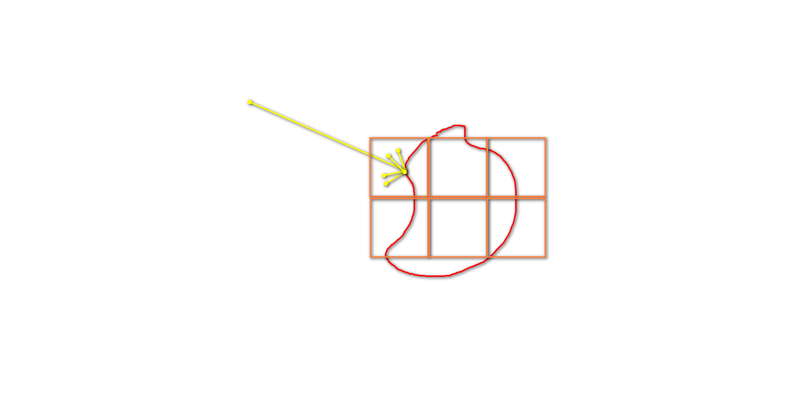

[toc]

# 0. 序言

​	global illuminate 全局光照我理解成是一种对光的分类，它比环境光更复杂。它表示来自四面八方比较近的光。在实时渲染中，全局光照包含**直接光照和一次间接光照**。它和离线渲染中的ray tracing发射无数次不同。

# 1. RSM（Reflective Shadow Map）

​	RSM的中心思想是通过shadow map生成直接光照能够照亮的像素。这些像素将成为**次级光源**，用来照亮其它shading point，计算一次间接光。

如上图，x1到x5都将成为次级光源。

为了求出间接光，**需要将所有次级光源的贡献加到shading point中**。

这个过程将造成极大的计算量。

假设一张512*512分辨率的shadow map就有262,144各次级光源。

需要注意的是：

* **不计算shading point和次级光源间的遮挡关系**，因为对于每一个shading point，对于所有的次级光源的遮挡关系都不同。这是一个O(n^2)的问题。
* **假设次级光源是diffuse的**。

优化——减少和shading point做计算的次级光源数量：

* 法线过滤：法线方向和shading point法线同向的次级光源不可能有贡献。
* 只采样近距离的次级光源（这部分贡献大）：包括在shadow map中限制一个圆形范围，场景深度比较或世界坐标距离比较等。

一个patch对shading point的贡献计算：

我们将一个次级光源像素当成是一个**很小的面光源**，对面光源进行采样的公式在Game101中提到过。
$$
f(o) = \int{L(i)f(i,o)\cos{\theta_p}\frac{\cos{\theta_q}dA}{||p-q||^2}}
$$
本质是对dw的换元。

因为每一个像素对应的面积很小，可以使用黎曼积分来近似：
$$
f(o) \approx L(i)f(i, o)\cos{\theta_p}\frac{\cos{\theta_q}\Delta A}{||p-q||^2}
$$
对于p点接受的L(i)，是q点发出的L(o).

现在，计算q点发出的L(o).

因为规定过次级光源是diffuse的，**再结合brdf的定义**
$$
f_{diffuse} = \frac{\rho}{\pi} \\
f_r = \frac{L(o)}{E(i)} \\ 
E(i) = \frac{d\phi}{dA} \\
$$
结合上面两个式子得到
$$
L(o) = \frac{\rho d\phi}{\pi dA}
$$
再代入渲染方程中得到：
$$
f(o) = \int{\rho f(i,o)\cos{\theta_p}\frac{\cos{\theta_q}\Delta\phi}{||p-q||^2\pi}}
$$
这里的微元和delta可以换用，因为前面使用了黎曼积分。

因此，对于**shadow map中的次级光源，只需要存储${\rho\phi}$** 即可。

# 2. LPV（Light Propagate Volume）

​	LPV光传播体素。闫老师只从high level对算法进行了概述，因为算法很复杂。

算法步骤总结如下：

1. 将场景分割成网格结构；

2. 使用shadow map求出次级光源，将次级光源inject到网格中；

    

3. 开始传播光线给附近的格子，传播方向是上下左右前后的六个格子。这个传播在所有格子同时进行，并且需要迭代多次达到稳定（这个稳定我猜是每个格子传出和接受的radiant相近）；

4. 格子内的radiant处处相等。

特别需要注意的是：

* 每个格子内往各个方向的radiant使用**球谐函数表示**，每个格子可能有多个次级面光源；
* **需要假设反射物是diffuse的；**

* 格子内的每一个点接收到的光，看作是这个格子内的微小环境光的作用结果。

# 3. VXGI

算法步骤总结如下：

1. 构建类似BVH的树形结构，和LPV一样，将次级光源注入BVH；
2. 从相机往shading point发射一条光线，根据shading point的rbdf lobe，发射**一个锥形的探测**代替发射多次光线；
3. 锥形探测将会和BVH不同层级的次级光源作用，求出出射radiant。

特别注意的是：

* 对于diffuse的材质，将**使用多个锥形探测**代替一个很大的锥形

# 4. SSAO （Screen Space Ambient Occlusion）

屏幕空间的环境遮蔽，环境光遮蔽做出了以下假设。

1. 任何shading point理应接受的**一次间接光为常数**
2. Ambient Occlusion定义的是不同shading point的**可见性**

背后的原理依旧离不开render equation。以下是近似表示：
$$
f(o) = \frac{\int{V(i)\cos{\theta_i}}d\omega}{\int\cos{\theta_i}d\omega}
\int L(i)f(i,o)\cos\theta_id\omega
$$
其中**brdf是diffuse的**
$$
f(o) = \frac{\int{V(i)\cos{\theta_i}}d\omega}{\pi}
c\int\frac{\rho}{\pi}\cos\theta_id\omega
$$
对于上面的式子可以看出。L(o)和**V(i)的加权平均**有关，这个值**被设置为KA**。

至于为什么式子的左边是$\cos{\theta_i}d\omega$,可以认为是换元。改为**对单位半球投影下的单位圆**进行采样。

如何求取KA的近似，方法如下：

上图左边，往shading point上半球发射光线，法线不会发生碰撞。

对于右边，发生光线发生碰撞，可以视为有遮挡。

但是在shading point中发射多次光线很消耗性能。取而代之的做法是**在规定半径R的上半球内，随机取多个点**，如果**点的深度比深度buffer中记录的值大**，则视为被遮挡。

**环境光遮蔽贴图**由此而来，因为模型大多数是刚体，它和模型的几何有关，和光照条件无关。

但是多个模型之间的遮挡很可能带来问题，这就是SSAO可能出现的**错误遮挡问题**。

想象一个桌子很后面的地板，地板上着色点采样的点的深度**远远大于桌子的景深**，这表明**两者间距离很远，理应不会发生关联**。但依照上面的算法，会误判为被遮挡。

# 5. HBAO

​	HBAO对SSAO进行了优化，是为了解决SSAO的问题。

​	我能想到的一种优化方式是**为景深的比较设置阈值**

# 6. SSDO

​	和SSAO相反，SSDO认为阻挡的点为shading point提供间接光贡献；而未阻挡的点不提供贡献。

SSDO的有点是，**不再假设一次间接光是一个常量**，SSDO所得的间接光颜色由阻挡的点提供。因此它比SSAO更真实，但是**它只适合近距离的间接光照**

另外，SSDO有Screen Space共有的问题，就是**所有的信息都只存在于屏幕空间中**，这些信息可能缺失。

# 7. SSR(Screen Space Reflect)

只要知道像素点的世界法线，世界坐标，光线的世界坐标，就能够发射光线，并将光线转换为屏幕空间。

后来，只需要一步一步**检测光线的景深大于景深buffer即可**，大于即是发生相交。

RayMarching的优化：

**最小值minmap**

算法需要注意的点：

1. 光线只前进，不后退；
2. 光线先走小的一步，如果没有发生相交，则步长加大，光线继续前进，并在更上层查找深度值；
3. 如果相交（可以求出交点），减少步长，在较低层查询深度值，光线继续尝试前进（重复23）。
4. 知道在最底层0层发生光线的相交。