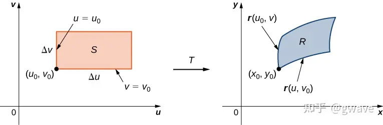
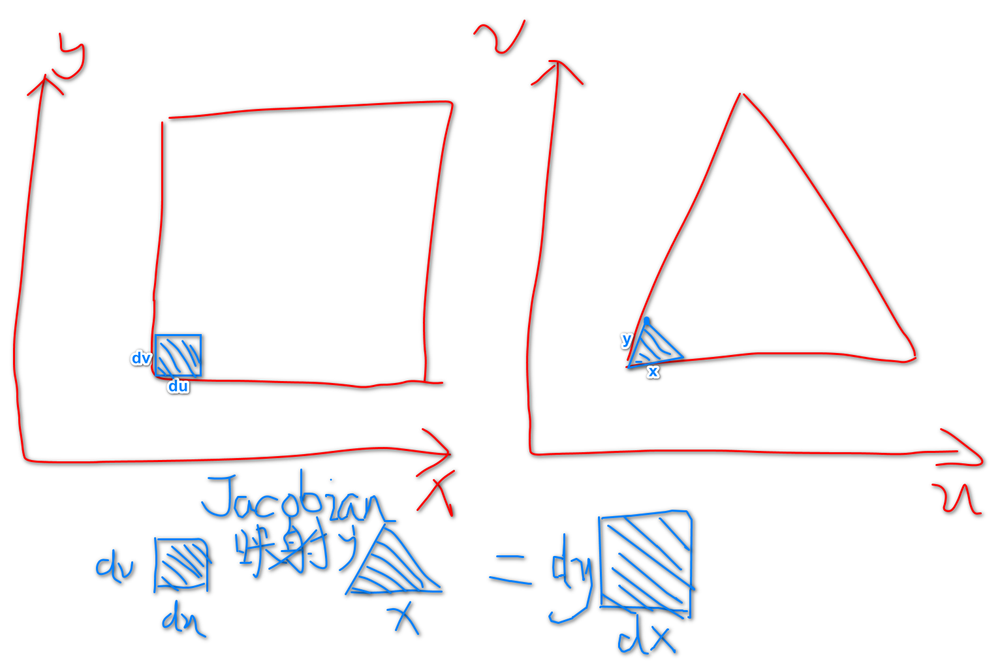
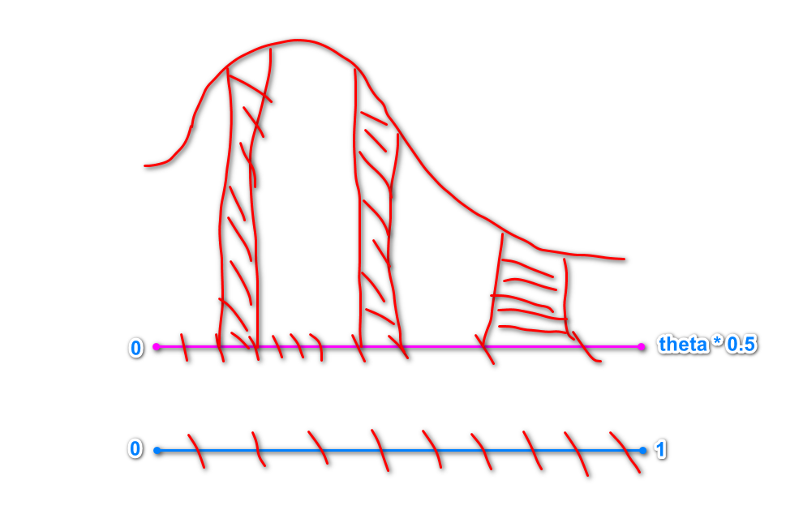

[toc]

# 0. 序言

​	PBR（Physics Base Rendering）基于物理的渲染，为什么要学习它，因为它是正确的。辐射度量学，rendering equation就是其中的基本和关键。

​	基于物理的材质，在实时领域中并不是真正的完全依照物理法则，它是基本物理经过简化和近似后的体现，为了适应实时的高速度要求。

# 1. Microfacet微表面模型

​	微表面模型将宏观下的表面解释为各种完美镜面反射的微小表面组成的。在一束光线打进微表面时，只有法线方向和**半程向量**同向的微表面才能将光反射给观察者。

​	微表面BRDF表达如下：
$$
f_r = \frac{F(i,h)G(i,o,h)D(h)}{4(n\cdot i)(n\cdot o)}
$$

* F菲涅尔项的Schlick近似：

$$
F = R_0 + (1 - R_0)(1 - \cos{\theta_i})^5 \\
R_0 = (\frac{n_1-n_2}{n_1+n_2})^2
$$

$R_0$是基础反射率，它由光线在两种传播介质中折射率$n_1和n_2$决定。

* G项（shadow masking  term）在GGX法线分布下的表达式：

$$
k = \frac{(roughness + 1) ^ 2}{8} \\
G_{schlick}(v, n) = \frac{n\cdot v}{n\cdot v(1 - k) + k} \\
G_{smith}(i, o, h) = G_{schlick}(l,h)G_{shlick}(o,h)
$$

G项表示微表面分别对视角和光线方向的遮挡，求其作用之乘。

这里特别说明一下：

​	在作业中，$G_{schlick}(l,h)G_{schlick}(o,h)$中传入**宏观表面的法线不会出错，不是半程向量**。

* GGX分布下的normal distribution：

$$
a = roughness^2 \\
D_{GGX}(h) = \frac{a^2}{\pi(((n\cdot h)^2(a^2 - 1) + 1))^2}
$$

​	GGX相比Beckman的法线分布具有**更长的尾巴**，它能使颜色过度更自然，在高光处产生类似光晕的效果。在graze angle小的时候（半程向量和宏观表面法线夹角比较大），会更亮。

# 2. GGX重要性采样

* 之所以需要重要性采样，是因为我们使用蒙特卡洛来求解积分。虽然它是无偏的，但是采样的方式会影响它的方差，重要性采样就是**在不增加采样数的前提下，尽可能减少方差**。

$$
\int{f(x)} \approx \frac{1}{N}\sum^N_{i=1}{\frac{f(x_i)}{pdf(x_i)}}
$$
​	证明：
$$
E(\frac{1}{N}\sum^N_{i=1}{\frac{f(x_i)}{\rho(x_i)}}) \\
= \frac{1}{N}\sum^N_{i=1}{\int\frac{f(x)pdf(x)}{pdf(x)}dx} \\
= \frac{1}{N}\sum^N_{i=1}{\int f(x)dx} \\
= \int f(x)dx
$$
这个证明来自[蒙特卡洛积分 - 知乎 (zhihu.com)](https://zhuanlan.zhihu.com/p/146144853)

老实说我一直不明白公式如何转换到第二行（难道是积分符号往内放）。

我是这样“理解的”的：

​	如果**每次都只采样一个点**，那么**一次蒙特卡洛积分的值是$\frac{f(x_i)}{pdf(x_i)}$**。

​	那么这时候要求蒙特卡洛积分的期望，**利用连续函数求期望的方式**
$$
E=\int\frac{f(x)}{pdf(x)}pdf(x)dx \\
= \int{f(x)dx}
$$
​	对于方差的验证就看上面的链接吧。

**重要性采样需要解决的是**

1. 如何采样？
2. 采样点对应的pdf是多少？

* GGX采样的pdf应该满足积分为1，**将使用$D(h)n\cdot h$**作为pdf函数

$$
1=\int_{\Omega^+}D(h)(n\cdot h)d\omega
$$

这个关系是这样来的，取面积微元dA，$D\dot(h)$表示法线朝向h的微表面的面积。因此将这些面积投影，面积总和一定是dA。
$$
dA=\int_{\Omega^+}D\dot (h)(n\cdot h)d\omega
$$
设$D(h)=\frac{D\dot (h)}{dA}$即可得到积分为1。

这个是对h的采样，但是**需要采样的是入射方向**
$$
i = 2 * (o \cdot h)h - o
$$
对采样的pdf需要进行转换，转换需要乘以一个**Jacobian矩阵行列式**
$$
pdf_i(i) = pdf_h(h) ||\frac{\partial w_h}{\partial w_i}||
$$
其中，对于反射有
$$
||\frac{\partial w_h}{\partial w_i}|| = \frac{1}{4(i\cdot h)}
$$
**简化后得到**
$$
pdf_i(i) = \frac{D(h)(n\cdot h)}{4(i\cdot h)}
$$
有关Jacobian矩阵，涉及到偏导数，梯度，行列式等的意义，这些我都忘了。充分暴露自己线性代数和高等数学学了和没学一样。

偏导数比较好理解。

* 梯度的定义是这样推导的：

​	**方向导数的定义**
$$
f(x+\Delta{x}, y+\Delta{y}) = \frac{\partial f}{\partial x}\Delta x + \frac{\partial f}{\partial y}\Delta y + o(\rho) \\

\frac{f(x+\Delta{x}, y+\Delta{y})}{\rho} = \frac{\partial f\Delta x}{\partial x\rho} + \frac{\partial f\Delta y}{\partial y\rho} + \frac{o(\rho)}{\rho} \\

\frac{\partial f}{\partial l} = \frac{\partial f}{\partial x}\cos{\varphi} + \frac{\partial f}{\partial y}\sin{\varphi}
$$
​	**梯度定义**
$$
gradient = \frac{\partial f}{\partial x}\overline{i} + \frac{\partial f}{\partial y}\overline{j}
$$
​	说明**梯度的含义**：令单位向量$\overline{e} = \cos{\varphi}\overline{i} + \sin{\varphi}\overline{j}$
$$
gradient \cdot e = \frac{\partial f}{\partial x}\cos{\varphi} + \frac{\partial f}{\partial y}\sin{\varphi} = |gradient|\cos{(gradient, e)}
$$
​	中间部分正是方向导数的定义，那什么时候方向导数最大，可以看出当**e的方向和gradient同向时，方向导数最大**

* Jacobian矩阵

我理解的Jacobian矩阵作用是**进行变量替换**，之所以进行变量替换，是为了将难的积分域转换到简单的积分域。

比如
$$
x = x(u,v), y = y(u,v)
$$
利用上面方向导数的求解过程得到
$$
\Delta{x} \approx \frac{\partial x}{\partial u}\Delta{u} + \frac{\partial x}{\partial v}\Delta{v} \\
\Delta{y} \approx \frac{\partial y}{\partial u}\Delta{u} + \frac{\partial y}{\partial v}\Delta{v}
$$
Jacobian矩阵就可以表示为
$$
\left[\begin{matrix}
\Delta{x} \\
\Delta{y}
\end{matrix}\right] = 
\left[\begin{matrix}
\frac{\partial x}{\partial u} & \frac{\partial x}{\partial v} \\
\frac{\partial y}{\partial u} & \frac{\partial y}{\partial v}
\end{matrix}\right]
\left[\begin{matrix}
\Delta{u} \\
\Delta{v}
\end{matrix}\right]
$$
假设我们已经将一个函数**从难的积分域变换到简单的积分域**中，利用的就是上面的uv代替xy，借用别人的图

现在取微元$\Delta u和\Delta v$, 被积分的面积微元是$\Delta u\Delta v$（这个是对替换后的变量进行积分）。

对应到原本变量空间的面积为
$$
\Delta u贡献的扰动为(\frac{\partial x}{\partial u}\Delta{u}, \frac{\partial y}{\partial u}\Delta u) \\
\Delta v贡献的扰动为(\frac{\partial x}{\partial v}\Delta{v}, \frac{\partial y}{\partial v}\Delta v)  \\
利用叉乘求平行四边形面积: R_{area} = |
(\frac{\partial x}{\partial u}\Delta{u}, \frac{\partial y}{\partial u}\Delta u) 
\cross 
(\frac{\partial x}{\partial v}\Delta{v}, \frac{\partial y}{\partial v}\Delta v)| \\
= 
\begin{vmatrix}
\frac{\partial x}{\partial u} & \frac{\partial x}{\partial v} \\
\frac{\partial y}{\partial u} & \frac{\partial y}{\partial v}
\end{vmatrix}\Delta{u}\Delta{u}
$$
可以看到，出现了Jacobian矩阵的行列式。

**进行变量替换后，是对替换后的量进行积分和取微元，为了对应原本变量组成的面积微元或体积微元，需要乘以Jacobian的行列式**

这也就是为什么**积分时常常要乘以一个Jacobian行列式了**
$$
\int\int{f(x, y)dxdy} = \int\int{f(x(u,v), y(u,v))|J(u,v)|dudv}
$$
参考为[理解Jacobian矩阵与行列式 - 知乎 (zhihu.com)](https://zhuanlan.zhihu.com/p/352438848)

至于结果为什么是$\frac{1}{4(i\cdot h)}$，参考[Kulla-Conty BRDF补充_重要性采样GGX - bluebean - 博客园 (cnblogs.com)](https://www.cnblogs.com/bluebean/p/17981163)

* 行列式

行列式理解为**由矩阵的每一个列向量围成的面积或者体积**

[深入理解 | 超详细行列式讲解 - 知乎 (zhihu.com)](https://zhuanlan.zhihu.com/p/360292803)

* 如何对h采样

$pdf_h(h)$在球面坐标系下的表示为，$sin{\theta_h}$是立体角转换到$\theta和\phi$时产生的
$$
pdf_h(h) = \frac{\alpha^2\cos{\theta_h}\sin{\theta_h}}{\pi({\cos\theta_h}^2(\alpha^2-1) + 1)^2}
$$
**边缘概率密度函数**
$$
pdf(\phi) = \int_{0}^{\frac{\pi}{2}}\frac{\alpha^2\cos{\theta_h}\sin{\theta_h}}{\pi({\cos\theta_h}^2(\alpha^2-1) + 1)^2}d\theta \\
= \frac{1}{2\pi}
$$

$$
pdf(\theta) = \int_{0}^{2\pi}\frac{\alpha^2\cos{\theta_h}\sin{\theta_h}}{\pi({\cos\theta_h}^2(\alpha^2-1) + 1)^2}d\phi \\
= \frac{2\alpha^2\cos{\theta_h}\sin{\theta_h}}{({\cos\theta_h}^2(\alpha^2-1) + 1)^2}
$$

**求CDF函数（概率的累计函数，似乎是pdf的定积分，即面积）**
$$
cdf(\phi) = \int_0^{\phi}\frac{1}{2\pi}d\phi \\
= \frac{\phi}{2\pi}
$$

$$
cdf(\theta) = \frac{\alpha^2}{(\alpha^2-1)^2\cos^2\theta + (\alpha^2 - 1)} - \frac{1}{\alpha^2-1}
$$

CDF的特点是只递增，**起点值为0，末尾值为1**。

令$\frac{\phi}{2\pi}=c_1$, 可以求得$\phi=c_12\pi$。
$$
\frac{\alpha^2}{(\alpha^2-1)^2\cos^2\theta + (\alpha^2 - 1)} - \frac{1}{\alpha^2-1} = c_2 \\
解得\theta = arccos\sqrt{\frac{1-c_2}{c_2(\alpha^2-1)+1}}
$$
**因此$c_1, c_2$的取值都是0到1**，可以反向求得一个 $\theta和\phi$。

为什么这样可以做到**对权重大的点多采样，权重少的点少采样**，0到1的值，反映的是pdf下面积的增量。如果在0到1上均匀采样，面积是等大增加的。对于概率高的地方（相当于矩形的高更大），相应的，矩形宽就会小。因此能够做到在概率高的地方以更小的步长采样。如下图：

[GGX重要性采样 - 闪之剑圣 - 博客园 (cnblogs.com)](https://www.cnblogs.com/wickedpriest/p/13788527.html)

**综上，得到最后的蒙特卡洛积分项为**
$$
\frac{G(i,o,h)(i\cdot h)}{(o\cdot n)(n\cdot h)} \\
文档中公式为
\frac{G(i,o,h)(o\cdot h)}{(o\cdot n)(n\cdot h)}
$$
