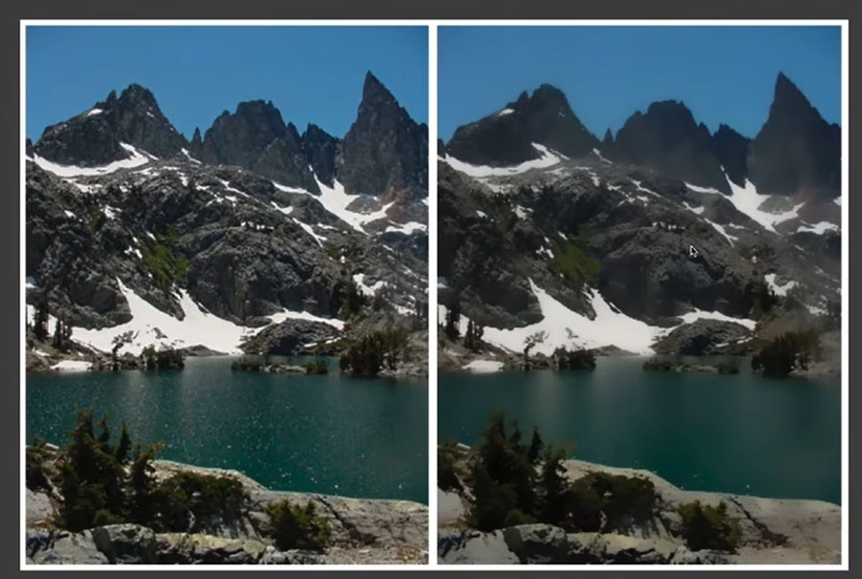
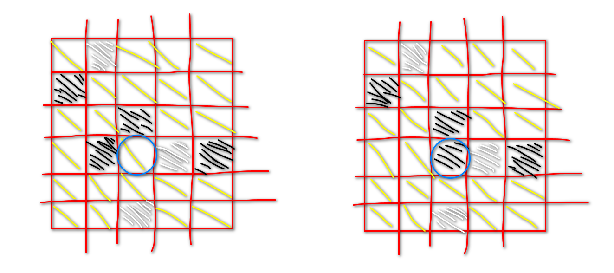
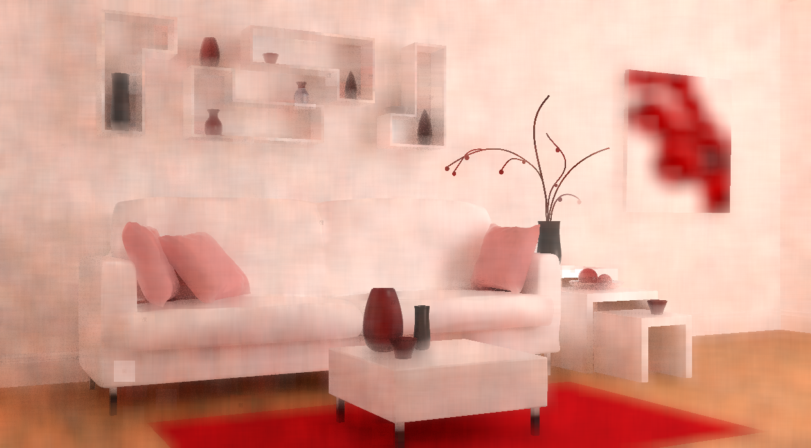
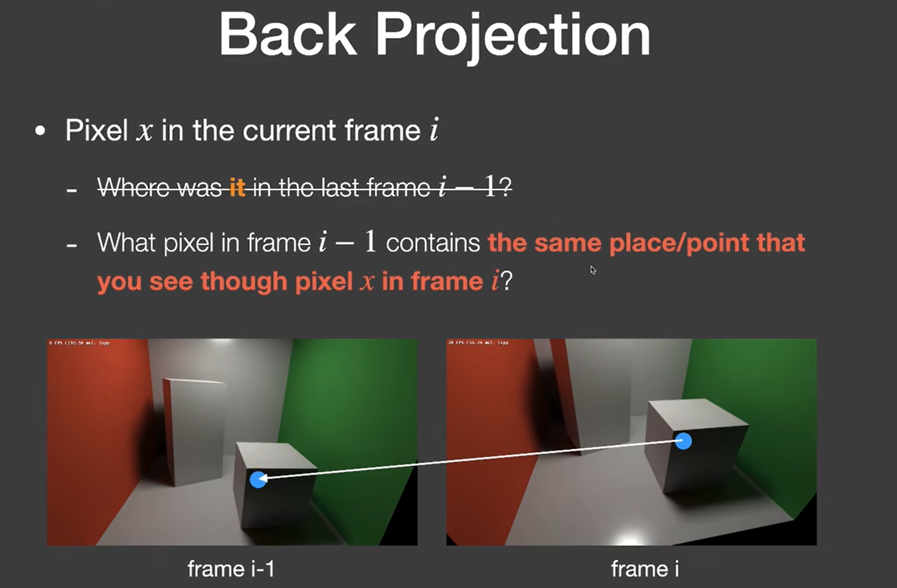
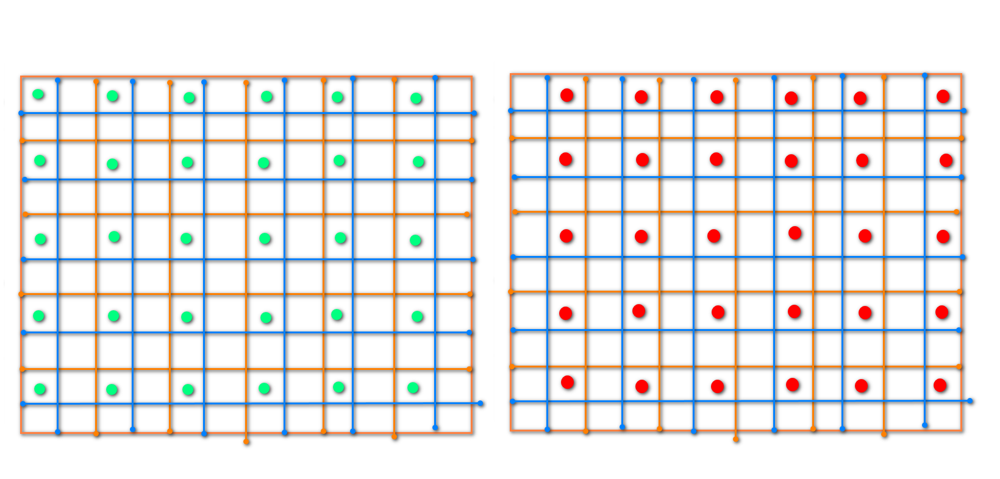
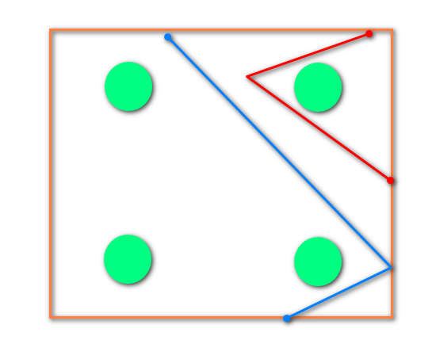
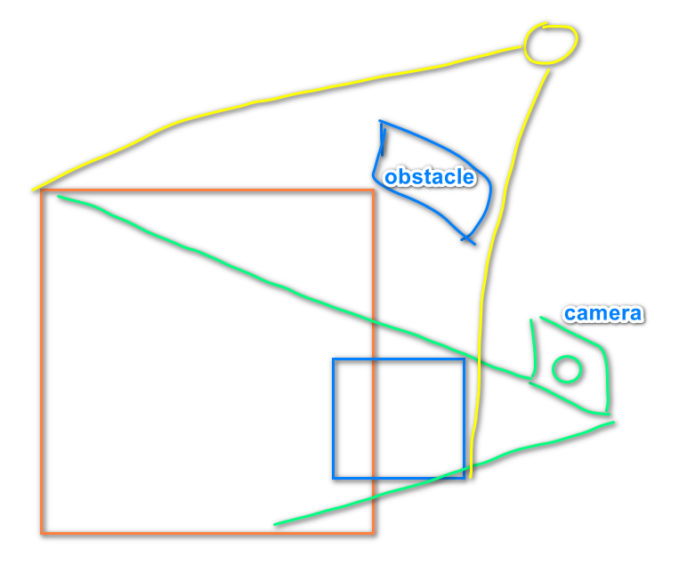

[toc]

# 0. 序言

​	实时光线追踪分为**软件实现**和**硬件实现**。

​	基于cpu的简单路径追踪在GAMES101中已经实现，它是离线渲染的。GAMES202提到的主要是基于硬件的光线追踪，和ue5基于软件追踪的lumen不同。它需要**显卡能够支持光线追踪**。2018年后Nvidia的RTX系列显卡出现了专门支持光线追踪的硬件（原本的GPU在构建bvh和使用bvh加速三角形求交不好做），这个硬件好像叫rtx。

​    每一秒同时发送的光线的数量有10亿个，这个数量只能支持**1SPP**。**1SPP**包括**Primary Ray（光栅化） ；Direct Light Sample（直接光）；Indirect bound ；Indirect Light Sample**。也就是说只有一个光路，并且这个光路只有一个直接光和一个间接光。

# 1. bilateral filter双边滤波

​	基于物理的光纤追踪，最大的问题就是**降噪**。我们知道，对图像做卷积操作相当于对图像做模糊。常用的**高斯模糊**最大问题就是**模糊边界**。双边滤波的做法是使用**颜色差异来区分是否为边缘**，**颜色相差大时为边缘，彼此奉献比较小；颜色相差小时彼此相互奉献大，达到模糊效果**。

​	**卷积核的值可以是动态变化的**。

## 1.1 joint bilateral filter联合双边滤波

​	与双边滤波不同，联合双边滤波的滤波核可以使用更多的GBuffer做为指标。比如Normal，Depth，Albedo ，Distance等。

# 2. 联合双边滤波降噪

​	作业中使用的滤波核定义如下：
$$
f(i, j) = e^{-\frac{||i - j||^2}{2\sigma_p^2} - \frac{||C(i) - C(j)||^2}{2\sigma_c^2}-\frac{D_{noraml}(i,j)^2}{2\sigma_n^2}-\frac{D_{plane}(i,j)^2}{2\sigma_p^2}} \\
D_{normal}(i,j) = arccos(Normal(i), Normal(j)) \\
D_{plane}(i,j) = Normal(i)\frac{Position(i)-Position(j)}{||Position(i)-Position(j)||}
$$
​	降噪的关键是**颜色值的贡献**，**噪点和正常的边缘的区别是颜色的方差**。正常的边缘方差并不大（因为差值在0-1）；蒙特卡洛造成的噪点方差更大（差值大于1；亮点，蒙特卡洛采样少造成的firefly；黑点，值最小为0）。

​	我将颜色核设置如下：
$$
\frac{-Pow(Position(i)-Position(j))^2}{2 * Sqrt(Variance(i)) * \sigma^2 + \epsilon}
$$
​	它的重点是，正常的边缘方差小于1，平方后值会更小，根号后值会更大；噪点方差大于1，平方后值会更大，根号后值会更小。

* 对于边缘，方差小于1。分子更小，分母更大，值更大，贡献大。
* 对于噪点，方差大于1。分子更大，分母更小，值更小，贡献小。

​	计算颜色方差的方式。考虑有噪点的图。

如果使用最一般的方差计算方法，需要算出**均值**，考虑下面两张图，它的**均值和方差是一样的**。

* 如果考虑的是噪点（右边）。我们需要其它点贡献值，来消除噪点。因此颜色贡献分母**要更大**，颜色值相差大也依旧有贡献。
* 如果考虑的是非噪点（左边）。我们希望其它噪点对该点的贡献少。因此颜色贡献分母**要更小**，颜色值相差大贡献小。

​	所以，这里计算颜色方差的方式不通过均值求出，**而是直接减去原本像素的值计算方差**。单次过滤结果如下，过滤核肯定可以优化得更好。

# 3. 时间上过滤Tempora Filter

​	为了得到更多的信息，可以复用上一帧的信息（一条光路信息）。当然需要确认两帧间的信息是关联的。这个通过**Motion Vector查询**。

​	特别需要注意的是，必须将模型转换到**模型空间，因为M表示模型的缩放和位移**。

$$
Screen_{i-1} = P_{i-1}V_{i-1}M_{i-1}M_i^{-1}Position_{world}
$$
​	基于时间的过滤会有很多问题

* 上一帧被遮挡，下一帧重新出现。Motion Vector在上一帧找到的物体和这一帧的物体不同。
* 对应的上一帧信息在屏幕外（Motion Vector指向屏幕外），这是Screen Space原有的问题。
* 虽然找到的上一帧是同一个物体，但shading的条件不同（比如光发生剧变，从绿色变为红色）。
* 场景发生了剧变。

总结起来就是**新一帧出现了新的信息，上一帧缺少对应信息或是上一帧信息错误**。

如果硬是使用上一帧的错误信息，将会造成**鬼影（Ghost）**。Ghost发生的这一帧，信息必须只用这一帧，如果使用上一帧错误的信息，会造成鬼影。

## 3.1 上一帧颜色Clamp

为了保证上一帧的信息是“正确的”，可以将上一帧的颜色进行Clamp。
$$
C(i-1) = clamp(C_{mean}(i) - kC_{variance}(i), C_{mean}(i) + kC_{variance}(i))
$$
Clamp会引入新的噪声，但解决了鬼影问题。

现在可以将上一帧的颜色贡献到这一帧里了。
$$
C(i) = \alpha C(i-1) + (1-\alpha)C(i)
$$
当然，还有一种方式——Detect检测。就是忽视不合法的上一帧颜色。

# 4. SVGF

SVGF设计了关于Normal，Position，Color，Depth的核如下。

*Normal权重：*
$$
w_n(i,j) = (Normal(i) \cdot Normal(j))^{\sigma_n}
$$
*Position权重：*
$$
w_p(i,j) = e^{\frac{-|i-j|}{\sigma_p}}
$$
*Depth权重：*
$$
w_d(i,j) = e^{\frac{-|D(i)-D(j)|}{\sigma_d|\gradient(i)\cdot(i-j)| + \epsilon}}
$$
使用梯度的原因是，如果是一个倾斜的平面，上面的点深度变化大，但理应彼此有贡献。所以需要使用梯度，增大分母的值。

这个梯度在球上会有问题，球上的点任何方向应该都是梯度方向。

*Color权重：*
$$
W_c(i,j) = \frac{-|C(i) - C(j)|}{\sigma_c\sqrt{3x3Variance(i, j) + \epsilon}}
$$

# 5. TAA（Temporary Anti-Aliasing）

​	基于时间的反走样，这里将**对一个像素划分为4个采样位置**。**对于静态的场景**，上一帧同时采样左上角，得到一个结果；下一帧同时采样右上角，得到另一个结果。

​	对这两个结果进行插值（相当于复用上一帧的信息）。

​	对于动态的场景，使用motion vector查找内容即可。

## 5.1 MSAA（基于采样的反走样）

*MSAA：*对于一个像素多次采样，发现**这个像素中有两个primary基元**，**每个基元只渲染一次**。并在最后将结果按比例blend即可。（**渲染才会浪费性能**）

*SSAA：*而SSAA的每一个采样点（如上四点）都要渲染一次，使用SSAA会降低帧率。

## 5.2 SMAA（基于后处理的反走样）

简单的流程是：对有锯齿的图片，先判断图片的**边缘**，对边缘附近的像素进行比例填充。

# 6. Early-Z

​	基元在渲染前不会对深度进行排序，因此对于随机渲染的三角形。有时候中间深度的三角形会通过zbuffer测试（更前的三角形没有渲染）。进行了不必要的渲染浪费。

​	会进行两次pass，第一次生成ZBuffer，而不进行渲染。第二次依赖ZBuffer来深度测试。

​	**使用这个方法无法做到基于采样的反走样**

# 7. Level Of Detail

​	多层级的细节，在合适的场合使用合适的细节。

* 比如cascade shadow map。
* cascade geometry。

ue5的nanite，就是LOD的Geometry。

Level Of Detail的最大问题就是**不同细节接缝处的缝隙**

# 8. DLSS和ARE

​	这些方法是基于人工智能的，DLSS是将**低分辨率的扩大为高分辨率**，DLSS1.0纯粹是使用AI来猜需要填充的信息；DLSS2.0则是AI生成Temporary的指导信息，使用上一帧的信息来填充数据。

# 9. Nanite和Lumen

Lumen实现的是软光追，所以不会依赖硬件光追。

Lumen的实现简述如下：

* 使用高质量的SDF来做近距离的RayMarching
* 使用较低质量的SDF来做远距离的RayMarching
* RSM应用于强光源
* 使用低多边形代替复杂的多边形用于光线碰撞

SDF的问题也显而易见，就是耗内存。SDF做光线追踪更容易。
